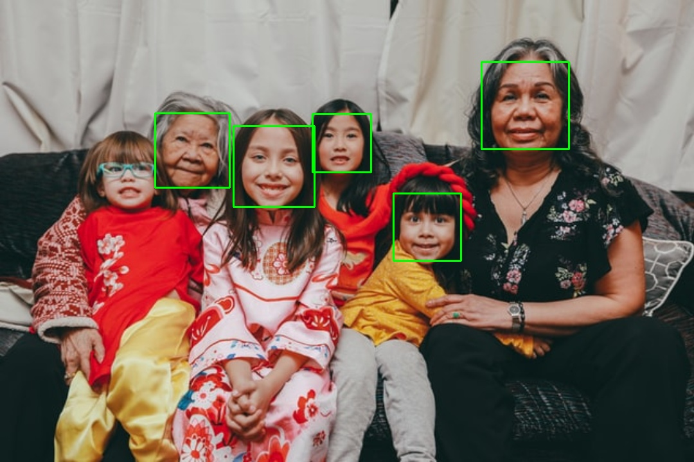

# face-detection

The program will receive an image and will draw a bounding box on each detected face.

  
   

## Docker

Docker image are available at [Docker Hub](https://hub.docker.com/repository/docker/jstnxu/face-detection/tags).

Read `README` file for more details on how to `build`, `pull`, or `run` the image from the following links.

 * [`face-detection:argparse`](argparse/README.md)
 * [`face-detection:flask`]()
